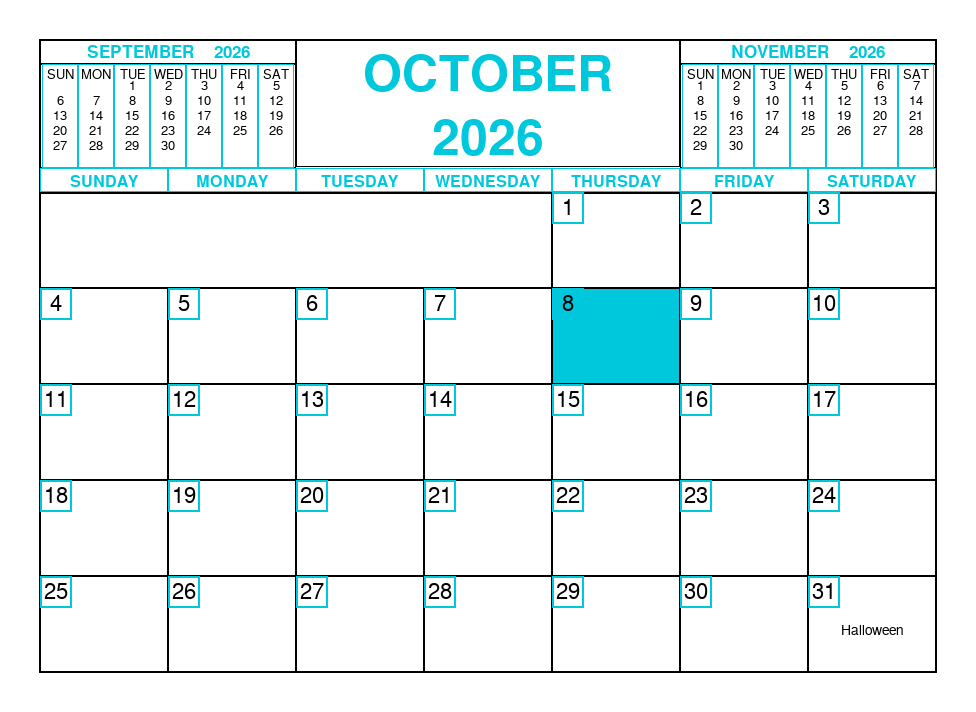
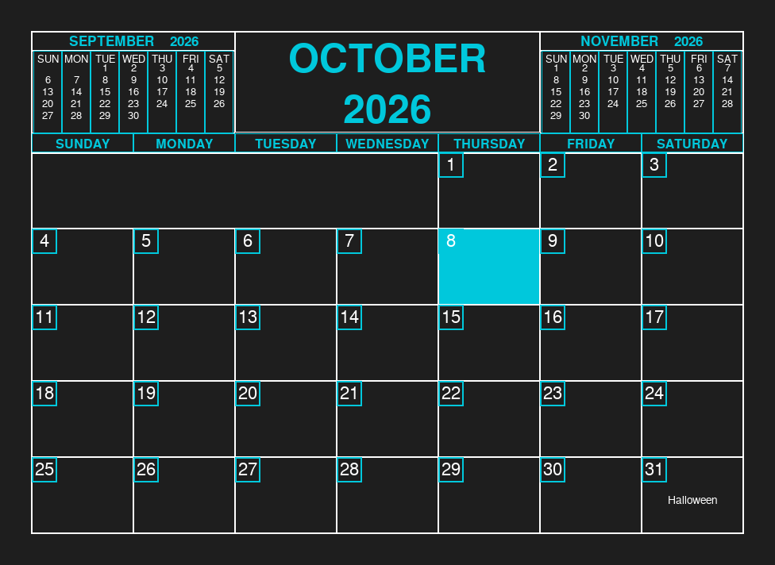

# ppc2 - Multi-featured Pretty Printable Calendar

Multi-featured calendar app that is truly like no other.
Built with Python and Pygame.

## Features
* 3 different window sizes, 6 custom highlight color schemes and
   Dark/Light modes
   
* US and European week start options

* Automatic holiday loading

* Standalone Linux AppImage executable

## Installation
Download 'ppc2-x86_64.AppImage' from the [Releases](https://github.com/edgargarcia1949/ppc2/releases) tab, make it executable, and run:
chmod +x ppc2-x86_64.AppImage
./ppc2-x86_64.AppImage
